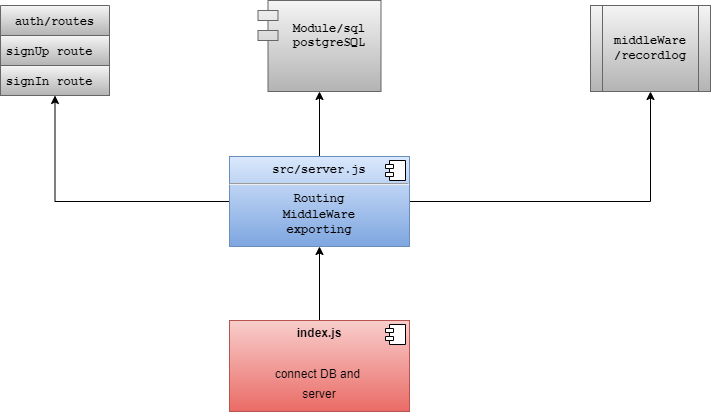

# basic-auth.server

## Server side Node.js application: Basic-Authorization-Server

### `Tools and Technologies Used in the Server:`

***1.Express: frameWork for Node.Js.***

***2.PostgreSQL: for as the DataBase.***

***3.Sequelize: for converting data between Postgres and the Server.***

#### users basic authorization with userName and PassWord headers are used in this server!  

### `author : Mamoun kamal bursi alshishani`

### UML :

